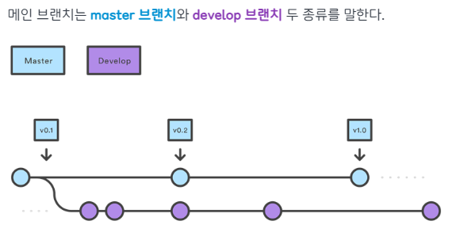
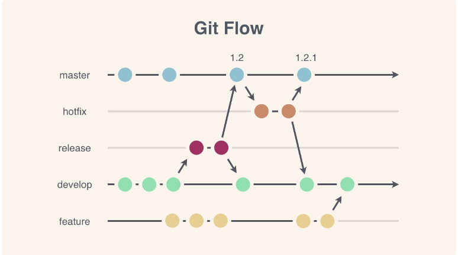

# 깃허브 브랜치 전략과 협업 플로우
이전에 반장이랑 '지전' 프로젝트를 진행할 땐 서로 깃허브가 처음이라 PR이고 커밋이고 컨벤션이고 하나도 몰랐다..    
사이드 프로젝트를 진행하려는데 깃허브로 제대로된 협업을 해보기 위해 사용할 줄을 몰라서 한나언니에게 물어봤다!

## PR (Pull Request)
코드의 변경 사항을 팀에 알리고, 검토를 요청하는 과정.   
PR을 통해 협업자들이 코드 변경 내용을 리뷰하고, 문제가 없다고 판단되면 메인 브랜치에 머지하게 됨.   
PR을 사용하면 코드 리뷰를 통해 품질을 높일 수 있고, 변경 사항에 대해 논의할 수 있음.

## ISSUE
ISSUE는 프로젝트에서 해야 할 일이나 버그, 개선 사항 등을 기록하는 기능.   
이슈를 통해 작업할 내용을 팀원들과 공유하고, 누가 어떤 일을 하고 있는지 추적 가능.   
이슈 번호를 PR에 연결하면, 어떤 이슈를 해결하는 PR인지 명확히 알 수 있어서 관리가 편해지게 됨.

## 코드리뷰
코드리뷰는 PR 단계에서 진행됨.   
팀원들이 PR을 보고 코드의 품질, 논리적 오류, 스타일 등을 검토.   
코드리뷰를 통해 버그를 사전에 발견하고, 코드의 일관성 유지 가능.   
리뷰어는 코드에 코멘트를 달아서 수정 요청을 할 수도 있고, 승인을 할 수도 있음.   
대체적으로 '유하게', '상냥하게', '시비조가 아닌' 말투로 진행하는것이 일종의 룰(?)로 자리잡음

## 브랜치 전략
브랜치 생성에 규칙을 만들어서 협업을 유연하게 하는 방법론   

- master 브랜치 : 배포 가능한 상태만을 관리
- develop 브랜치 : 다음에 배포할 것을 개발

### Git Flow

- 메인 브랜치: main (또는 master)
- 개발 브랜치: develop
- 기능 브랜치: feature/*
- 릴리즈 브랜치: release/*
- 핫픽스 브랜치: hotfix/*
---
- develop 브랜치에서 기능 브랜치를 만들어 작업하고, 완료되면 다시 develop에 머지
- 릴리즈 전에는 release 브랜치에서 테스트를 진행하고, 긴급 수정이 필요할 때는 hotfix 브랜치를 사용.
- 항시 유지되는 메인 브랜치 master, develop 2가지와 merge 되면 사라지는 보조 브랜치 feature, release, hotfix 3가지

### GitHub Flow

- 메인 브랜치: main
- 기능 브랜치: feature/*
---
- 기능 브랜치에서 작업을 하고, 완료되면 main 브랜치로 PR
- 코드 리뷰와 테스트를 거쳐 문제가 없으면 main에 머지.

### GitLab Flow

- 다양한 브랜치를 사용할 수 있지만, 일반적으로는 main, pre-production, production 브랜치를 사용
- 각 브랜치마다 목적에 맞게 사용하고, 환경에 배포하기 전에 pre-production 브랜치에서 테스트를 진행

   
### 언니에게 들은 협업 깃허브의 흐름
1. 깃허브 협업 흐름 정리
2. 브랜치 전략과 커밋/PR 컨벤션 설정
3. 깃허브 이슈 등록 (할 일)
4. 이슈 번호 발행 (자동)
5. 작업 (commit 단위로 잘라서)
6. 테스트용 브랜치에 작업 커밋들 모아서 PR (확인 요청)
7. 확인해야 하는 사람들 PR에 초대
8. 코드리뷰 / 코드확인 / 질문 등의 작업
9. 수정할 게 많으면 PR을 닫고 수정 후 다시 PR
10. OK 받으면 Main이나 dev 브랜치에 merge 작업 진행

---
#### 참고
- ❤ 아름다운 대 괴도 한나   
- [깃허브 브랜치 전략](https://inpa.tistory.com/entry/GIT-%E2%9A%A1%EF%B8%8F-github-flow-git-flow-%F0%9F%93%88-%EB%B8%8C%EB%9E%9C%EC%B9%98-%EC%A0%84%EB%9E%B5#%EB%A7%8C%EC%9D%BC_%EB%B8%8C%EB%9E%9C%EC%B9%98_%EC%A0%84%EB%9E%B5%EC%9D%B4_%EC%97%86%EC%9C%BC%EB%A9%B4?)
- [GIT 브랜치 전략](https://hudi.blog/git-branch-strategy/)