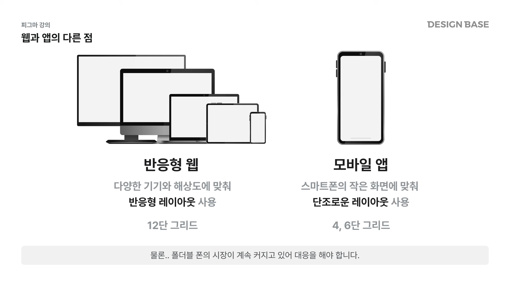
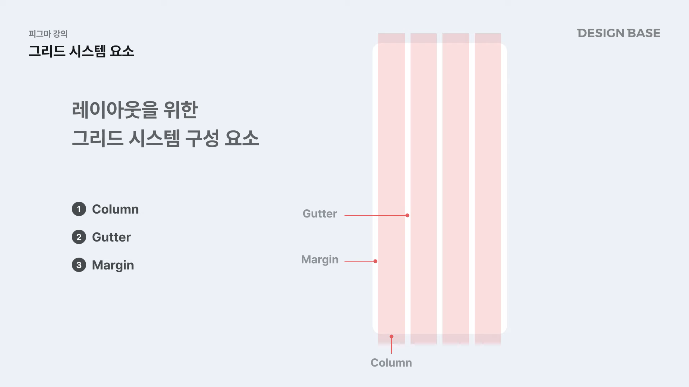
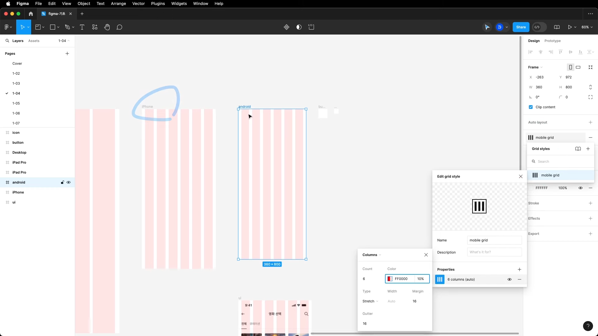
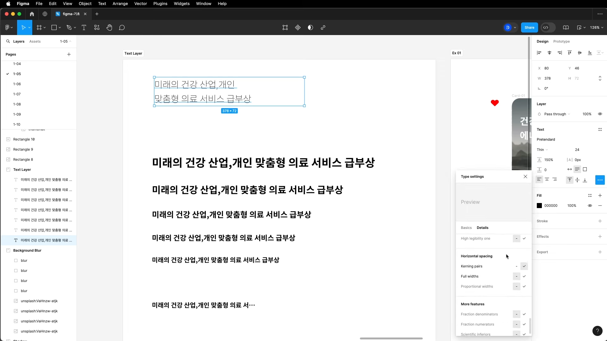
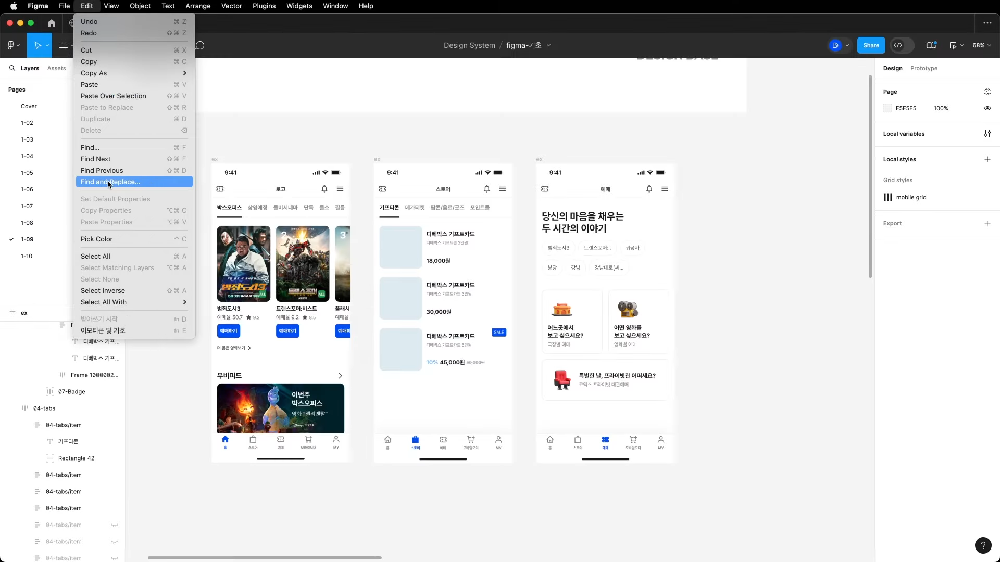

# ~07.09 첫 번째 스터디 전까지 과제 | 유튜브 디자인베이스 피그마강좌(최신 2024) 1.1 - 1.9
[링크](https://youtube.com/playlist?list=PLkbzizJk4Ae9L-n9yEquO9T927speoMWd&si=MYK8YwJIk_QfU_rk)

## 피그마 기초부터 마스터까지 - 피그마 강좌 1-1
### FIGMA를 사용하는 이유
1. 클라우드 기반으로 작동하여 컴퓨터에 저장할 필요가 없음
2. 윈도우, 맥의 OS 제약 받지 않고 동일 환경에서 작업/협업 가능
3. 팀원과 실시간 협업 가능
4. 커뮤니티를 통해 다양한 에셋과 플러그인 제공
5. 기획과 프로토타이핑, 개발모드까지 다 제공하는 최적의 프로젝트 디자인 툴

## 피그마 기초부터 마스터까지 - 피그마 강좌 1-2

## 피그마 기초부터 마스터까지 - 피그마 강좌 1-3

- SECTION 크기 조정은 우상단에 있는 FIT을 누르면 ARTBOARD 기준으로 딱 맞게 예쁘게 사이즈 조정됨
- 
## 피그마 기초부터 마스터까지 - 피그마 강좌 1-4 레이아웃과 그리드

모바일은 보통 4

작은 ui 컴포넌트(버튼, 인풋칸 등)는 GRID로 관리하는게 정확한 수치 내기에 유리함

## 피그마 기초부터 마스터까지 - 피그마 강좌 1-5 도형과 텍스트 UI 스타일링

## 피그마 기초부터 마스터까지 - 피그마 강좌 1-6

## 피그마 기초부터 마스터까지 - 피그마 강좌 1-7

## 피그마 기초부터 마스터까지 - 피그마 강좌 1-8

## 피그마 기초부터 마스터까지 - 피그마 강좌 1-9

텍스트 일괄변경 플러그인 Change Text

피그마 EDIT- FIND AND REPLACE도 같은 기능을 함(이쪽이 더 좋을지도..)