# ~07.14 두 번째 스터디 전까지 과제 | 유튜브 디자인베이스 피그마강좌(최신 2024) 2.1 - 2.9
[디자인베이스 2024 최신 피그마 강좌 챕터2 링크](https://youtu.be/UvAIH0wyMuY?si=IgtJEmEYo38bystP)

### 2.1 스타일

- 스타일이란 디자인 요소들에 적용되는 일관된 속성 집합
- 스타일 통일, 형상 관리 용이, 효율적인 수정

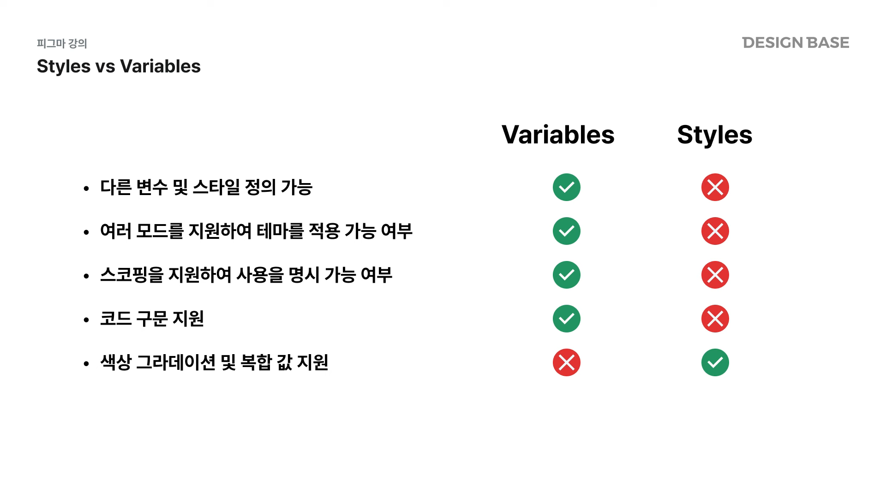
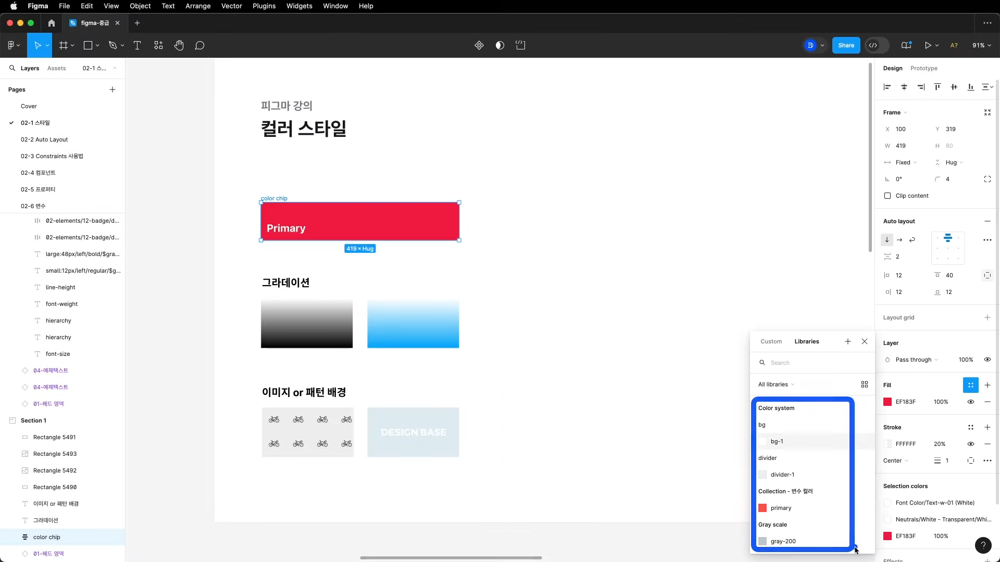
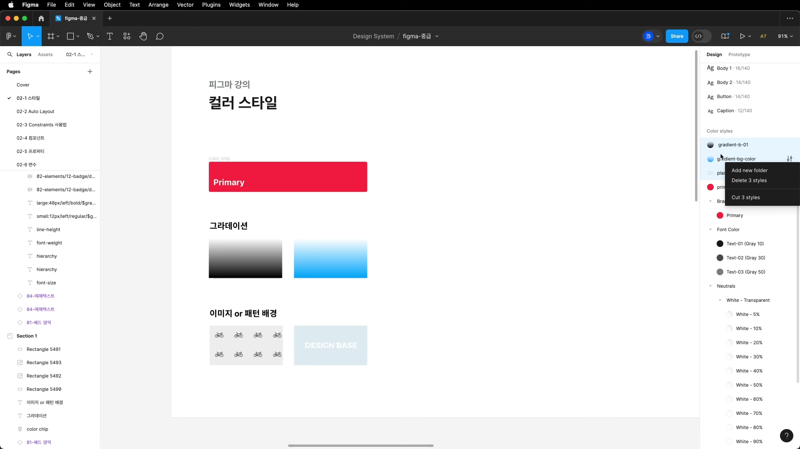
스타일 설정, 그룹화 가능!!
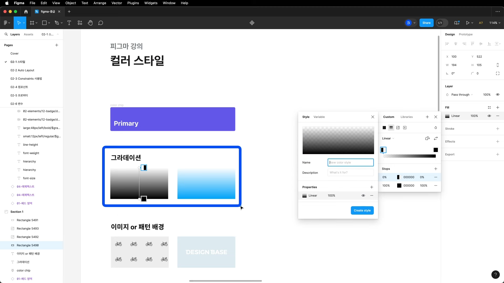
Gradient는 변수 등록이 불가능함 -> 스타일 등록해야함

### 2.2 오토레이아웃
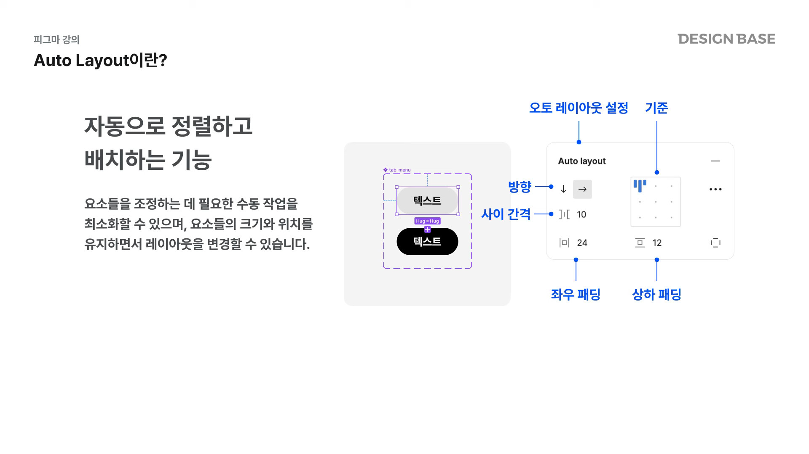
단축키는 shif + a, 우측 패널의 Auto Layout
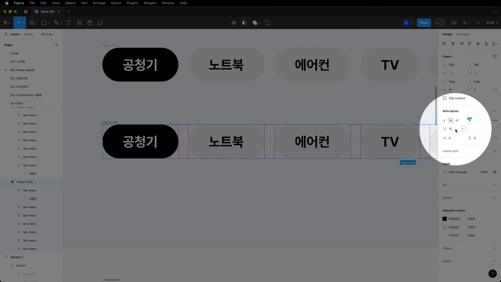
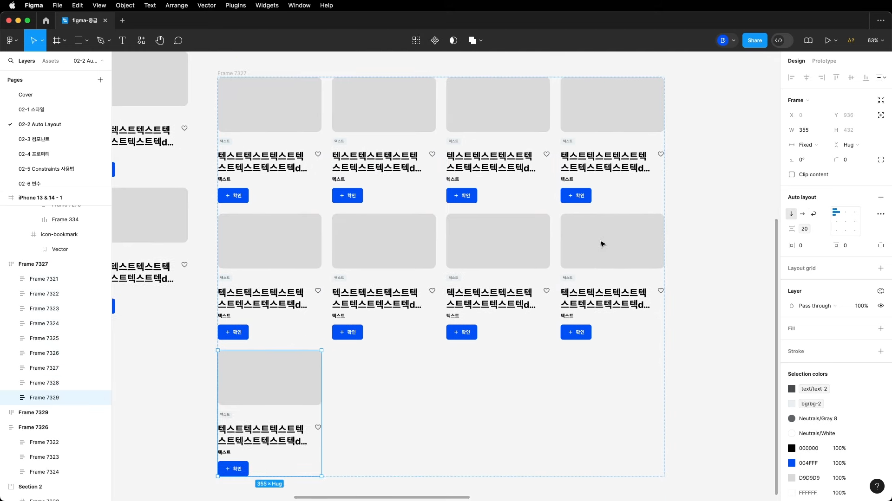
width fixed 설정 후 복제하면 컨텐츠 자동 줄바꿈 가능
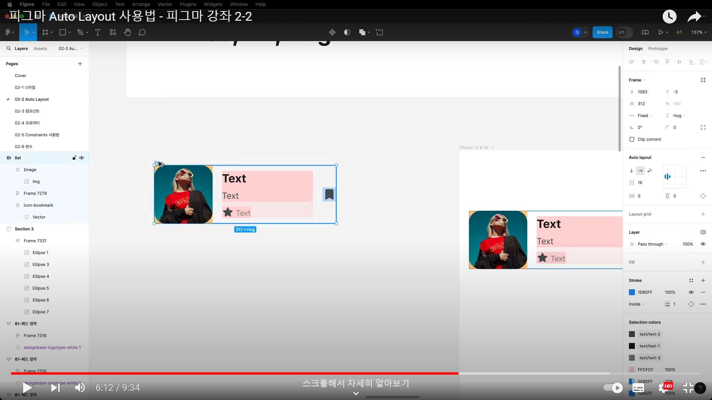
Fixed 고정 Fill 유동적으로 채우기

### 2.3 Constraints
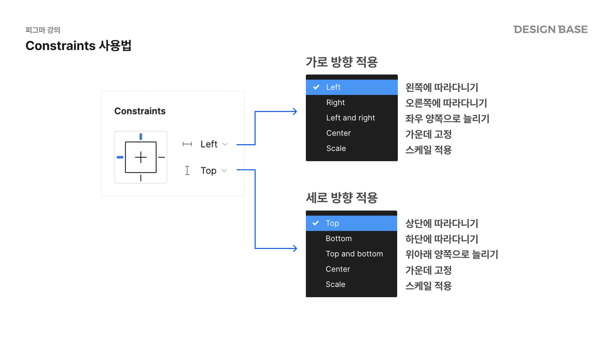

### 2.4 Component
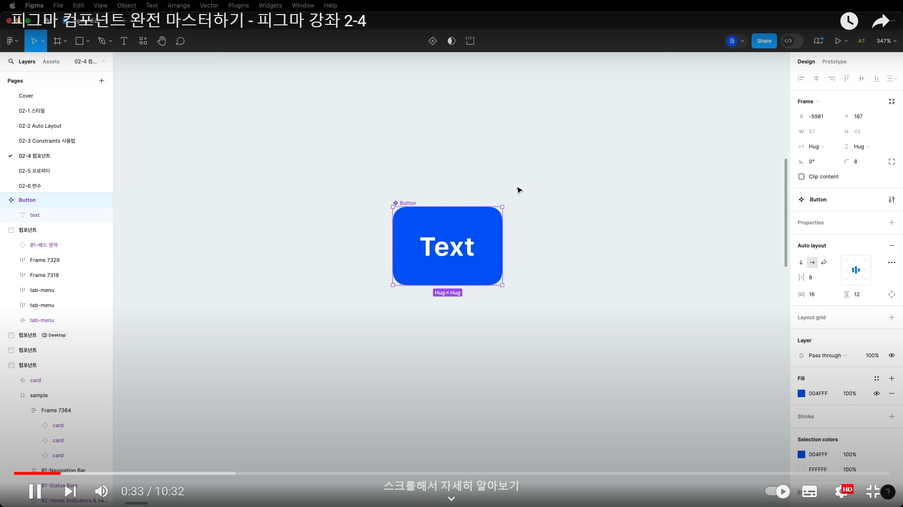
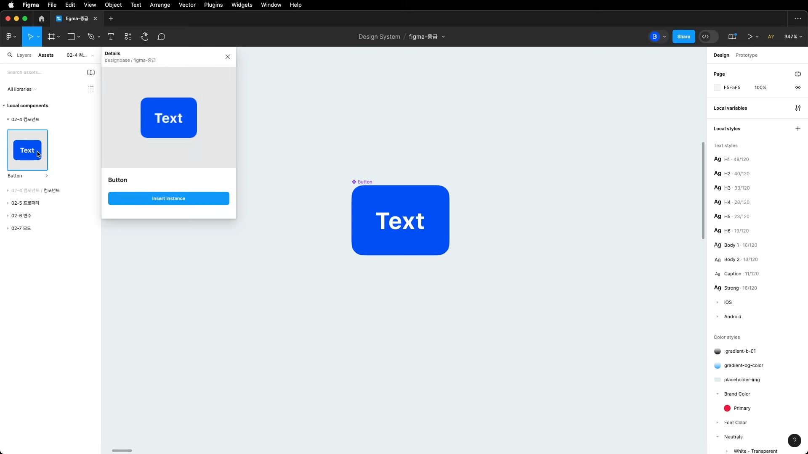
- asset에서 등록 컴포넌트를 확인할 수 있음
- Instance 컴포넌트는 Master(원본)컴포넌트의 복사본
- Mater 컴포넌트를 변경하면 Instance들도 다 영향을 받음
- Instance 각각도 수정 가능 BUT 나머지한테 영향 x
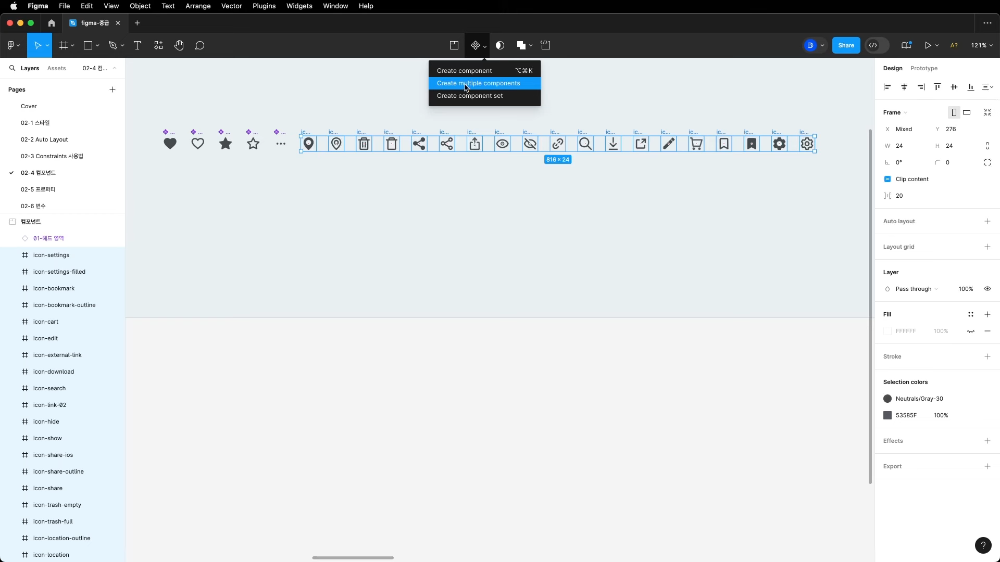
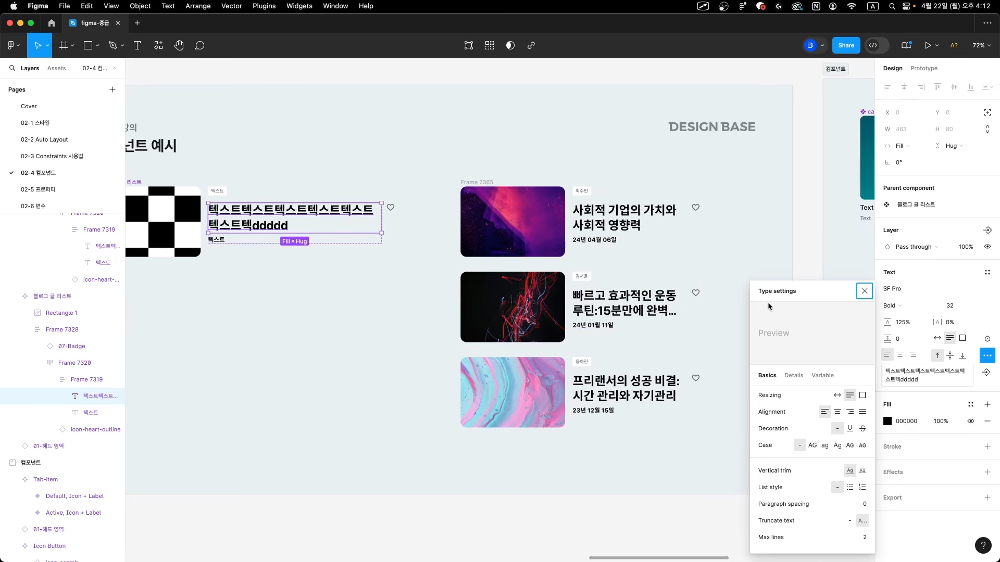

### 2.5 Property
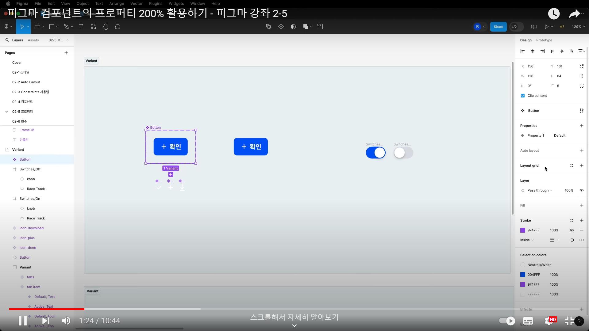
Varient 추가!! 타입 추가라는 뜻
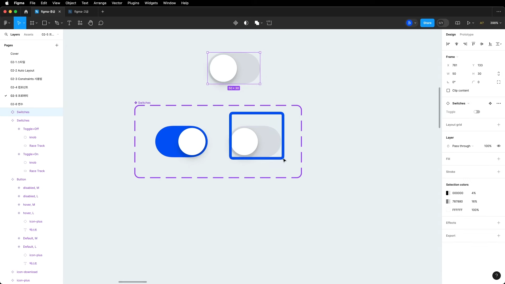
이름을 on, off로 하면 토글 형태로 주어짐

### 2.6 변수
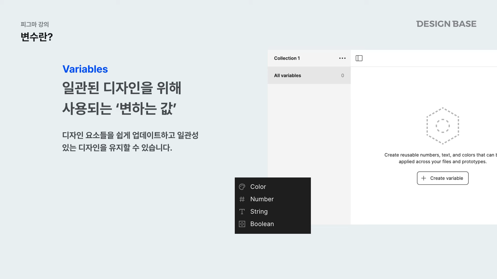
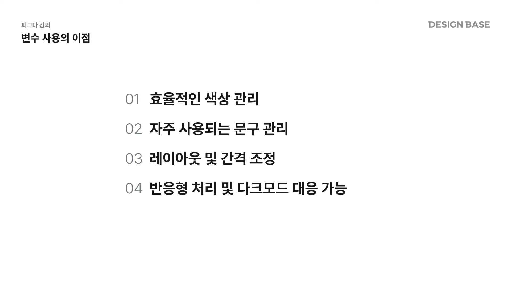

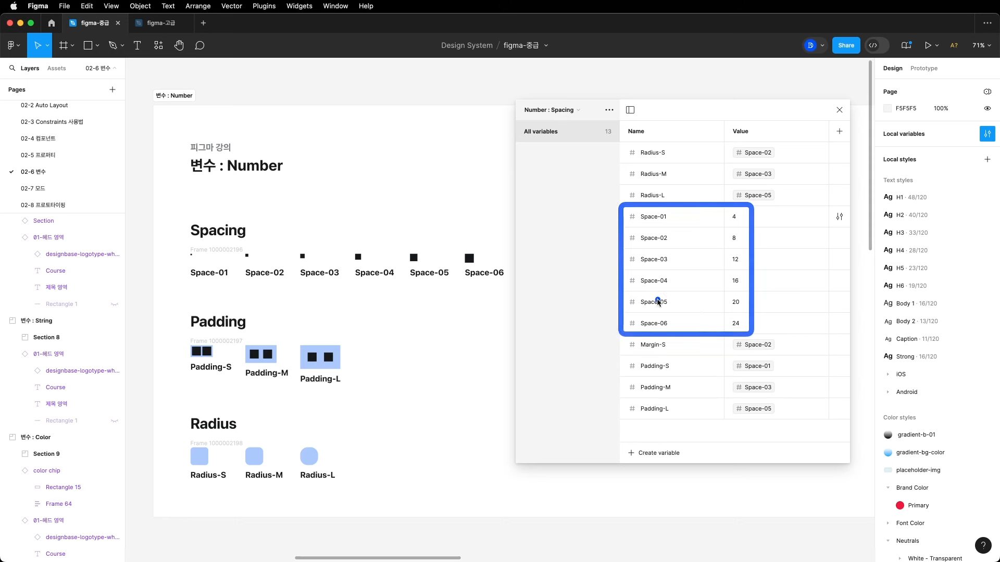
