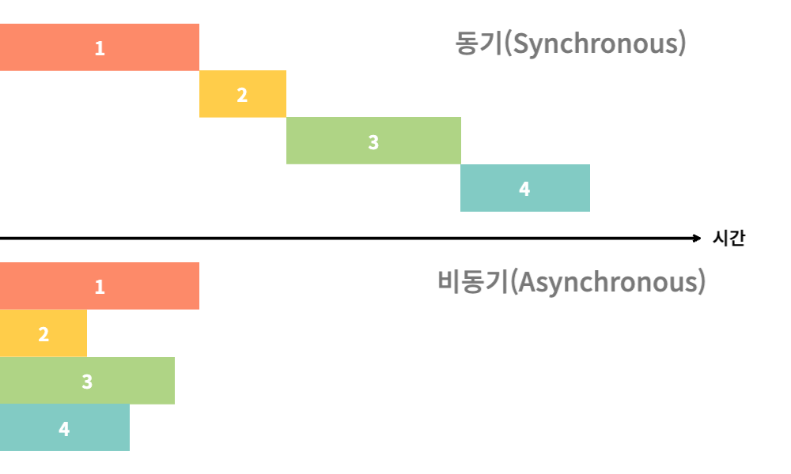
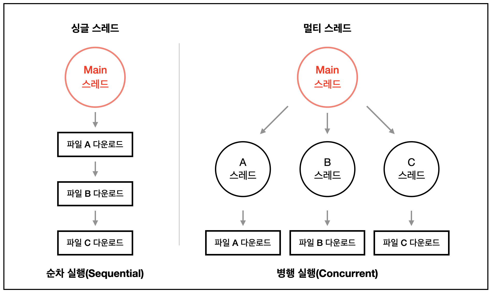
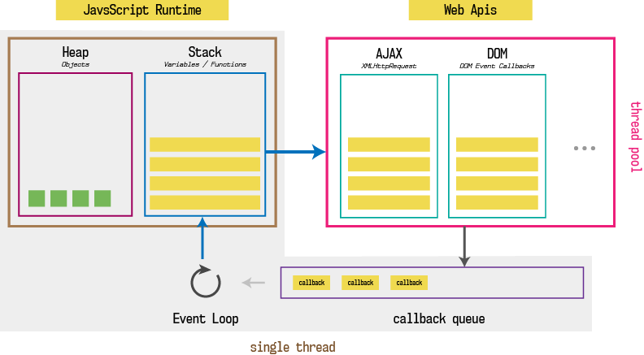

## 240608(토요일)

### 2.11 동기와 비동기

자바 스크립트는 기본적으로 모든 코드가 '동기적'으로 실행됨
- 동기
  - 동기는 데이터의 요청과 결과가 한 자리에서 동시에 일어나는것
  - 시간이 얼마나 걸리던간에 먼저 요청한 것에 대한 응답이 오고 나서 다음 요청을 실행함
  - 👍 설계가 간단하고 직관적임 -> 이해와 오류 처리가 쉬움, 작업이 순서대로 실행되어 결과 예측 가능함
  - 👎 결과가 주어질때까지 대기해야함 -> 병렬 처리가 어려워 처리량이 낮음, 처리 속도가 느려짐
- 비동기
  - 요청 순서는 응답 순서와 관계 없음
  - 서버에 데이터 요청 후 응답을 계속 기다리고 있을 필요가 없으며 다른 활동이나 다른 요청을 보내도 됨
  - 👍 요청에 대한 결과가 반환되는 시간 동안 다른 작업 수행 가능 -> 빠른 작업, 높은 처리량과 병렬 처리 가능
  - 👎 설계가 복잡함
- 블록
  - 동기의 개념에서 만들어진 상태
  - 하나의 요청에 대한 응답을 기다릴 때 다른 요청이 대기하고 있는 상태를 블록 상태라고 부름
- 논블록
  - 비동기의 개념에서 만들어진 상태
  - 앞선 요청에 대한 응답을 기다리지 않고 자유롭게 사용할 수 있는 상황

- 스레드 (Thread)
  - 프로세스가 할당받은 자원을 이용하는 실행 단위
  - JS는 기본적으로 싱글 스레드임
- 멀티 스레드 (Multi Thread)
  - 프로그램의 둘 이상을 동시에 실행하는 기술
  - JS가 멀티 스레드같이 비동기적 작업을 할 수 있는 이유는 JS엔진에서 실행되는 것이 아니고 콜백 함수, 비동기적 코드를 Web APIs라는 브라우저의 별도 영역(기능)을 사용해 처리하기 때문

### 2.12 비동기 작업 처리하기 1. 콜백함수

- 콜백이 깊으면 깊어질수록 가독성이 안좋아짐 (화살표 형태)
- 콜백 지옥에 주의할 것 -> Promise를 이용하기

### 2.13 비동기 작업 처리하기 2. Promise

- 비동기 작업을 효율적으로 처리할 수 있도록 도와주는 JS의 내장 객체
- 비동기 작업 실행, 상태 관리, 결과 저장, 병렬 실행, 다시 실행 등등 ..
- 대기(Pending)
  - 비동기 작업이 진행중이며 완료되지 않은 상태
  - ex 유튜브 영상 로딩
- 해결(Resolve)
  - 비동기 작업이 대기 상태였다가 성공 상태로 바뀌는 것
  - ex 로딩 완료
- 성공(Fulfilled)
  - 비동기 작업이 성공적으로 마무리 된 상태
  - ex 시청 가능해진 상태 그 자체
- 거부(Reject)
  - 비동기 작업이 대기 상태였다가 모종의 이유로 실패 상태로 바뀌는 것
  - ex 영상 로딩 실패
- 실패(Rejected)
  - 비동기 작업이 실패한 상태
  - ex 시청 불가능한 상태 그 자체

- 비동기 작업을 실행하는 함수, executor
    - 인수로 promise의 값을 전달해줄 수 있음

- then & catch
- 프로미스 체이닝 (Promise Chaining)

### 2.14 비동기 작업 처리하기 3. async & await

- async
  -  어떤 함수를 비동기 함수로 만들어주는 키워드
  -  함수가 프로미스를 반환하도록 변환해줌
- await
  - async 내부에서만 사용이 가능한 키워드
  - 비동기 함수가 다 처리되기를 기다리는 역할

 
 

---

#### 참고
- https://velog.io/@slobber/%EB%8F%99%EA%B8%B0%EC%99%80-%EB%B9%84%EB%8F%99%EA%B8%B0%EC%9D%98-%EC%B0%A8%EC%9D%B4
- https://velog.io/@gil0127/%EC%8B%B1%EA%B8%80%EC%8A%A4%EB%A0%88%EB%93%9CSingle-thread-vs-%EB%A9%80%ED%8B%B0%EC%8A%A4%EB%A0%88%EB%93%9C-Multi-thread-t5gv4udj
- https://leehyungi0622.github.io/2021/05/09/202105/210509-JavaScript_Engine_and_Browser/
- 추가 공부 | https://ssungkang.tistory.com/entry/ES6-Promises-then-catch-all-race-finally